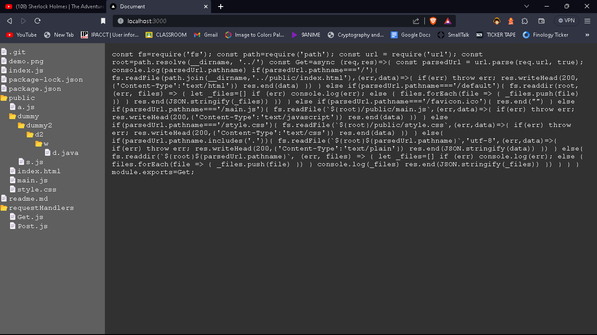

# Directory Host

This is a simple Node.js application that serves files and directories from the server's file system.

## Getting Started

These instructions will get you a copy of the project up and running on your local machine 

### Prerequisites

- Node.js
- npm

### Installing

1. Clone the repository
2. Navigate to the project directory
3. Run `npm install` to install the dependencies

make sure your current node version supports `--watch` flag else remove the `--watch`  from the script in `package.json`
### Running the application

To start the application, run the following command in your terminal:

```
npm run start
```
The application will start on http://localhost:3000
##Demo 

## Built With
Node.js - The runtime used
npm - Dependency Management
## Authors
Anirudha D. Pradhan
## License
This project is licensed under the ISC License.
